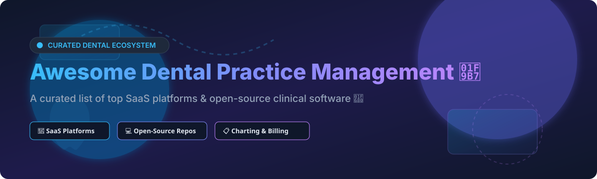

# 🦷 Awesome Dental Practice Management 🏥

  
  
  

## 📌 Overview & Ecosystem Guide

Welcome to the comprehensive, SEO-optimized list of **Dental Practice Management Software (DPMS)**, clinical charting solutions, electronic health record (EHR) platforms, and patient engagement tools. Whether you are running a solo private dental clinic, managing a multi-location Dental Support Organization (DSO), or developing open-source medical software, this guide covers both leading enterprise SaaS platforms and active open-source GitHub projects. ⚡

---

## 📊 SaaS & Hosted Dental Platforms

### 📈 Market Size & Industry Dynamics
The global **Dental Practice Management Software Market** is estimated at **~$2.2 Billion** (2025/2026) and is projected to expand to **$4.5B+ by 2034** (CAGR ~8.8%). The sector is **moderately fragmented**, featuring established corporate leaders alongside agile cloud-native platforms.

| Software Platform 🏥 | Company Scale (Revenue/Valuation) 💰 | Pricing / Starting Tier 💵 | Free Tier / Trial Limit ⏱️ | Key Capabilities & Features 🛠️ |
| :--- | :--- | :--- | :--- | :--- |
| **[Dentrix](https://www.dentrix.com/)** | **~$12.8 Billion** (Parent Henry Schein) | ~$150 – $300 / month / user | No free trial (Personalized live demo) | Enterprise market leader, imaging suite, insurance integration, DSO workflows |
| **[Eaglesoft](https://www.eaglesoft.net/)** | **~$6.3 Billion** (Parent Patterson Dental) | ~$200 – $350 / month / location | No free trial (Consultation & demo) | Comprehensive clinical charting, billing, Patterson distribution ecosystem integration |
| **[Sensei Cloud](https://www.sensei.cloud/)** | **~$2.0 Billion** (Parent Carestream Dental) | ~$250 – $400 / month | No free trial (Guided live demo) | Cloud PMS by Carestream, advanced 3D/2D imaging integration, clinical workflows |
| **[CareStack](https://carestack.com/)** | **~$100 Million – $155 Million** | ~$698 / month / practice | 14-day trial available upon request | All-in-one cloud platform, patient engagement, revenue cycle management (RCM) |
| **[Denticon](https://www.planetdds.com/)** | **~$100 Million ARR** (Planet DDS) | ~$280 / month / location | No free trial (Enterprise demo) | DSO-focused enterprise cloud PMS, centralized reporting, multi-location security |
| **[Curve Dental](https://www.curvedental.com/)** | **~$100 Million ARR** | ~$200 – $350 / month / dentist | No free trial (Interactive web demo) | 100% cloud-native PMS, digital charting, smart scheduling, web access |
| **[Open Dental](https://www.opendental.com/)** | **~$30 Million – $50 Million** | **$179 / month** per location | Full free test drive (Demo mode & test database) | High data control, documented REST API, SQL queries, self-hosted or cloud |
| **[tab32](https://tab32.com/)** | **~$15 Million – $25 Million** | **$125 / month** per user | 14-day free trial | Serverless cloud PMS, open API architecture, patient communication suite |
| **[Dentally](https://www.dentally.co/)** | **~$10 Million – $20 Million** | ~$150 / month (£120/mo) | No free trial (Personalized demo) | Cloud-based PMS popular in UK & Europe, modern UI, online patient portal |
| **[Practice-Web](https://www.practice-web.com/)** | **~$5 Million – $10 Million** | **$149 / month** | 30-day trial mode with demo data | Affordable on-premise/cloud PMS, automated patient messaging, tooth charting |

---

## 💻 Open-Source GitHub Projects

Below are open-source dental clinic software repositories sorted by GitHub community popularity (Stars_Count descending). ⭐

| Repository & Link 📦 | GitHub_Stars 🌟 | Primary Tech Stack 🛠️ | License 📜 | Description & Key Features 📝 |
| :--- | :--- | :--- | :--- | :--- |
| **[dentalpin/dentalpin](https://github.com/dentalpin/dentalpin)** |  | TypeScript, React | AGPL-3.0 | AI-native open-source dental practice management software with smart scheduling & clinical notes. |
| **[alselawi/apexo-flutter](https://github.com/alselawi/apexo-flutter)** |  | Dart, Flutter, PocketBase | GPL-3.0 | Cross-platform, offline-first dental clinic manager for Windows, Android, and Web. |
| **[OpenDental/opendental](https://github.com/OpenDental/opendental)** |  | C#, .NET, MySQL | Proprietary (GPL v24.3) | Source mirror of the classic Open Dental software suite. |
| **[ganraj21/Dental_Clinic](https://github.com/ganraj21/Dental_Clinic)** |  | JavaScript, HTML, CSS | MIT | Modern single-page material design frontend template for dental clinic websites. |
| **[ambientWave/Odoo-Dental-Clinic](https://github.com/ambientWave/Odoo-Dental-Clinic-Managment-System-With-REST-API)** |  | Python, Odoo ERP | LGPL-3.0 | Dental clinic management module integrated with Odoo ERP and REST API. |
| **[ImagingYeditepe/Segmentation-of-Teeth](https://github.com/ImagingYeditepe/Segmentation-of-Teeth-in-Panoramic-X-ray-Image)** |  | Python, PyTorch / U-Net | MIT | Deep learning U-Net model for automatic semantic segmentation of panoramic dental X-rays. |
| **[thefinalcutbg/DinoDent](https://github.com/thefinalcutbg/DinoDent)** |  | C++, Qt6 | GPL-3.0 | Modern C++/Qt6 dental practice suite with e-signatures, periodontal charting, and NHIF API integration. |
| **[clawnify/OpenDentist](https://github.com/clawnify/OpenDentist)** |  | JavaScript, React, Node.js | MIT | Lightweight web-based dental practice management platform built with React. |
| **[mhzsm7/Dental-Diary](https://github.com/mhzsm7/Dental-Diary)** |  | Dart, Flutter, PHP | MIT | Full-stack patient and appointment booking application for dental clinics. |
| **[onlyjob/openmolar1](https://github.com/onlyjob/openmolar1)** |  | Python, Qt5, MySQL | GPLv3 | Lightweight classic open-source dental software with ISO tooth charting. |
| **[cld-kent0/Generic-DCMS](https://github.com/cld-kent0/Generic-DCMS)** |  | PHP, MySQL | MIT | Minimal standalone dental clinic management system for patient records and billing. |

---

## 🤝 How to Contribute

Contributions are warmly welcomed! 🎉
1. Fork this repository 🍴
2. Add your SaaS or Open-Source project to `README.md` following the table structure 📝
3. Submit a Pull Request with a short summary of changes 🚀

---

## 💖 Support & Community

If you find this repository helpful, please consider showing your support:
* ⭐ **Star** this repository on GitHub
* 🍴 **Fork** it to share with your colleagues
* 💬 Join the conversation on [Discord](https://discord.gg/jc4xtF58Ve)
* ☕ Sponsor or buy me a coffee via [GitHub Sponsors](https://github.com/sponsors/ishandutta2007)

Thank you for helping make dental practice software more accessible, transparent, and open! ❤️

---

## 📈 Star History

---

## ⚠️ Disclaimer

This repository is for informational and educational purposes. Ensure full HIPAA, GDPR, and local medical privacy compliance when deploying dental practice software handling protected health information (PHI).
